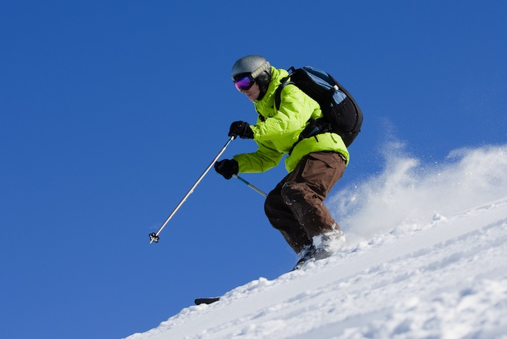
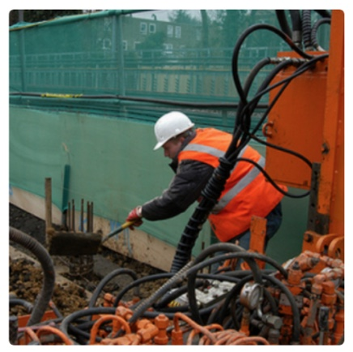

# CaptiVision : An image captioning project

To generate a caption for any image in natural language, English. The architecture for the model is inspired from [1] by Vinyals et al. The module is built using [keras](https://keras.io/), the deep learning library. 

This repository serves two purposes:
- present/ discuss my model and results I obtained
- provide a simple architecture for image captioning to the community

## Model 

The Image captioning model has been implemented using the Sequential API of keras. It consists of three components:
1. __An encoder CNN model__: A pre-trained CNN is used to encode an image to its features. In this implementation VGG16 model[d] is used as encoder and with its pretrained weights loaded. The last softmax layer of VGG16 is removed and the vector of dimention (4096,) is obtained from the second last layer. 

	_To speed up my training, I pre-encoded each image to its feature set. This is done in the `prepare_dataset.py` file to form a resultant pickle file `encoded_images.p`. In the current version, the image model takes the (4096,) dimension encoded image vector as input. This can be overrided by uncommenting the VGG model lines in `caption_generator.py`. There is no fine tuning in the current version but can be implemented._

2. __A word embedding model__: Since the number of unique words can be large, a one hot encoding of the words is not a good idea. An embedding model is trained that takes a word and outputs an embedding vector of dimension (1, 128).

	_Pre-trained word embeddings can also be used._

3. __A decoder RNN model__: A LSTM network has been employed for the task of generating captions. It takes the image vector and partial captions at the current timestep and input and generated the next most probable word as output. 

The overall architecture of the model is described by the following picture. It also shows the input and output dimension of each layer in the model. 

    

## Dataset
The model has been trained and tested on Flickr8k dataset[2]. There are many other datasets available that can used as well like:	
- Flickr30k
- MS COCO
- SBU
- Pascal
- 
## Performance
The model has been trained for 20 epoches on 6000 training samples of Flickr8k Dataset. It acheives a `BLEU-1 = ~0.59` with 1000 testing samples.

----------------------------------

## Requirements
- tensorflow
- keras
- numpy
- h5py
- progressbar2

These requirements can be easily installed by:
  `pip install -r requirements.txt`

## Scripts

- __caption_generator.py__: The base script that contains functions for model creation, batch data generator etc.
- __prepare_data.py__: Extracts features from images using VGG16 imagenet model. Also prepares annotation for training. Changes have to be done to this script if new dataset is to be used.
- __train_model.py__: Module for training the caption generator.
- __eval_model.py__: Contains module for evaluating and testing the performance of the caption generator, currently, it contains the [BLEU](https://en.wikipedia.org/wiki/BLEU) metric.

## Usage

### Pre-trained model
1. Download pre-trained weights from [releases](https://github.com/Div99/Image-Captioning/releases)
2. Move `model_weight.h5` to `models` directory
3. Prepare data using `python prepare_data.py`
4. For inference on example image, run: `python eval_model.py -i [img-path]`

### From scratch
After the requirements have been installed, the process from training to testing is fairly easy. The commands to run:
1. `python prepare_data.py`
2. `python train_model.py`
3. `python eval_model.py`

After training, evaluation on an example image can be done by running:  
`python eval_model.py -m [model-checkpoint] -i [img-path]`

## Results

Image | Caption 
--- | --- 
 | **Generated Caption:**  A white and black dog is running through the water
 | **Generated Caption:** man is skiing on snowy hill
 | **Generated Caption:** man in red shirt is walking down the street

----------------------------------

## References
[1] Oriol Vinyals, Alexander Toshev, Samy Bengio, Dumitru Erhan. [Show and Tell: A Neural Image Caption Generator](https://arxiv.org/pdf/1411.4555.pdf)

[2]	Kelvin Xu, Jimmy Ba, Ryan Kiros, Kyunghyun Cho, Aaron Courville, Ruslan Salakhutdinov, Richard Zemel, Yoshua Bengio. [Show, Attend and Tell: Neural Image Caption Generation with Visual Attention](https://arxiv.org/pdf/1502.03044.pdf)

----------------------------------

## License
MIT License. See LICENSE file for details.
